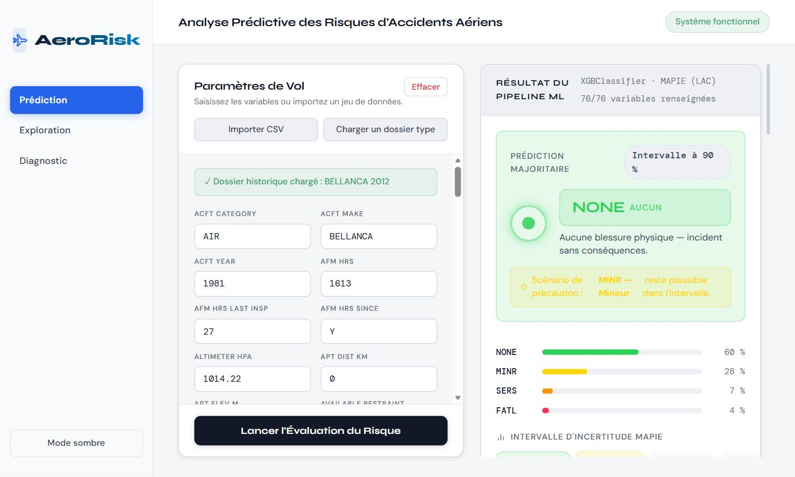
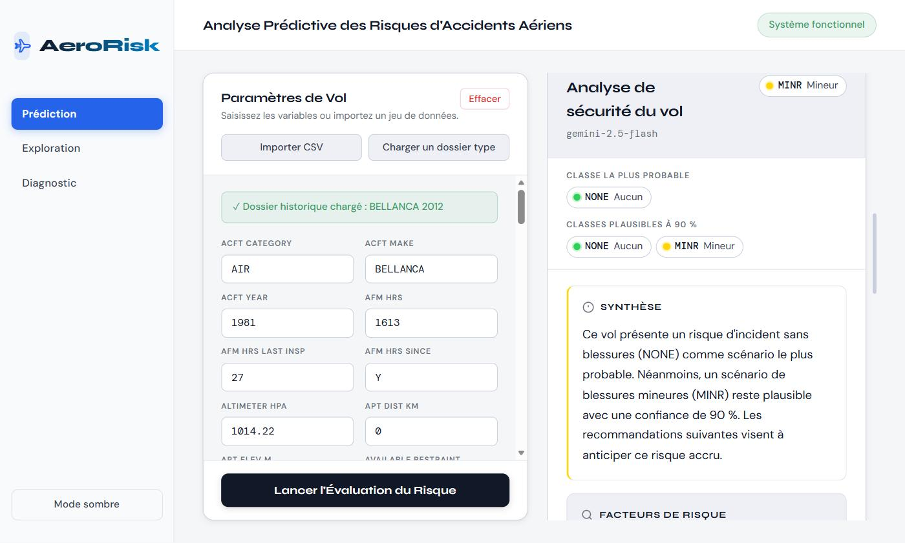
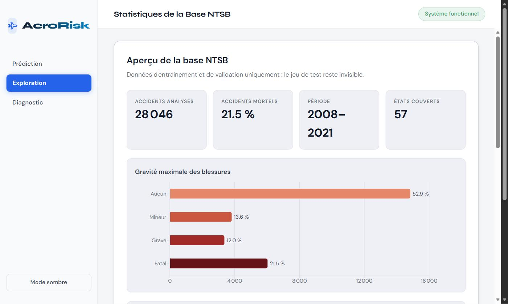
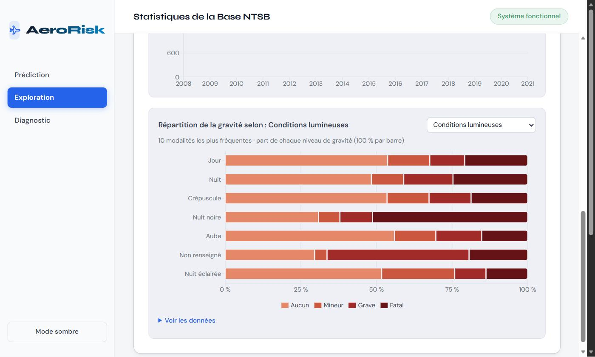
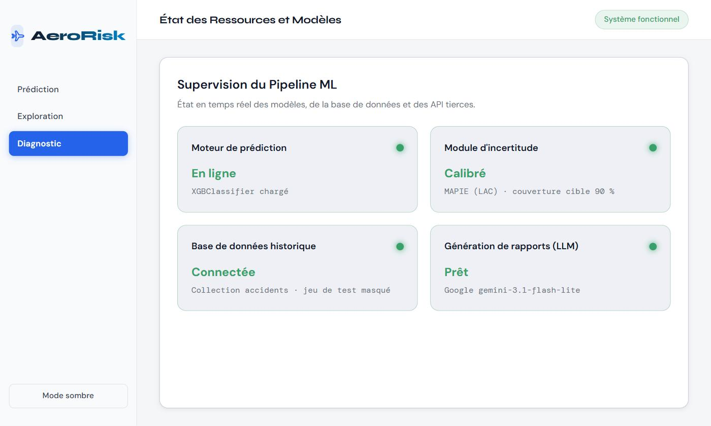

# AeroRisk : prédiction de la gravité des accidents aériens

Projet de fin d'année (PFA) 2026, réalisé par **Wend Kouni Eddie Eliel ZIDA** et **Soukaina DAALI**. À partir des rapports d'accidents de la **NTSB** (National
Transportation Safety Board, 2008 → 2026) enrichis de la météo **NOAA**, l'application estime la
**gravité maximale des blessures** d'un événement (`NONE`, `MINR`, `SERS`, `FATL`), quantifie
l'incertitude de cette estimation par **prédiction conforme (MAPIE)** et génère un **rapport de
sécurité** avec un LLM (Google Gemini), rédigé en se préparant au pire scénario plausible.

[](https://github.com/EddieZIDA/aviation-risk-predictor/actions/workflows/ci.yml)      

---

## Aperçu de l'application

L'interface compte trois vues : **Prédiction**, **Exploration** et **Diagnostic**.

### Prédiction et incertitude

Un dossier NTSB (importé en CSV ou tiré de la base) est envoyé à l'API. L'application affiche la
classe la plus probable, les probabilités par classe et l'**ensemble de classes plausibles à 90 %**
calculé par MAPIE. Le scénario le plus grave de cet ensemble devient le *scénario de précaution*.



### Rapport de sécurité généré par Gemini

Le LLM rédige une synthèse, les facteurs de risque et des recommandations, ancrés sur le scénario
de précaution plutôt que sur la seule classe majoritaire.



### Exploration de la base NTSB

Indicateurs globaux et graphiques interactifs calculés sur les données d'entraînement et de
validation uniquement : le jeu de test reste invisible depuis l'interface.

| Vue d'ensemble | Gravité selon une variable |
|---|---|
|  |  |

### Diagnostic

État en temps réel du modèle, du module d'incertitude, de MongoDB et du service Gemini
(route `/api/health`).



---

## Architecture

```
data/raw/avall.mdb (NTSB) + NOAA GSOD
        │  notebooks/01_data_preparation   nettoyage, fusion, unités SI
        ▼
data/processed/ntsb_clean_final.csv ─────────────► seed_mongo.py ──► MongoDB (collection accidents,
        │                                                              champ split train/val/test)
        │  notebooks/02_eda_visualisation   analyse exploratoire
        │  notebooks/03_feature_engineering ◄── backend/utils/feature_engineering.py
        │  notebooks/04_modeling               (source unique, partagée avec l'API)
        │  notebooks/05_uncertainty_lac
        ▼
notebooks/outputs/*.pkl, baseline_models/, uncertainty_outputs/
        │
        ▼
backend/ (Flask, port 5005) ── /api/predict, /api/report (Gemini), /api/historical/*, /api/health
        │
        ▼
frontend/ (React + Vite, port 5173) ── Prédiction · Exploration · Diagnostic
```

**Principe clé : une seule implémentation du feature engineering.**
`backend/utils/feature_engineering.py` est importé par le notebook 03 (entraînement), par l'API
(inférence) et par `seed_mongo.py` (découpage train/val/test). Le test
`backend/tests/test_feature_parity.py` vérifie que l'API reproduit **bit à bit**
`notebooks/outputs/X_test.csv` et les mêmes prédictions que le notebook.

---

## Installation

Prérequis : Python 3.12, Node.js 20, MongoDB 7 (local), une clé API Gemini (facultative,
SDK `google-genai`).

```bash
# 1. Environnement Python unique (notebooks + backend)
python -m venv .venv
.venv\Scripts\activate                     # Windows  (Linux/macOS : source .venv/bin/activate)
pip install -r requirements.txt
python -m ipykernel install --user --name aviation-risk --display-name "aviation-risk (.venv)"

# 2. Configuration
copy backend\.env.example backend\.env      # puis renseigner GEMINI_API_KEY

# 3. Frontend
cd frontend && npm install
```

> Les versions de `requirements.txt` sont **figées** : un fichier `.pkl` scikit-learn / XGBoost
> n'est fiable qu'avec la version qui l'a créé. Toute montée de version impose de ré-exécuter
> les notebooks 03 → 05.

## Reproduire le pipeline ML

Ouvrir les notebooks avec le noyau **aviation-risk (.venv)** et les exécuter dans l'ordre :

| Notebook | Rôle | Sorties |
|---|---|---|
| `01_data_preparation` | extraction NTSB, fusion NOAA, nettoyage, imputation, unités SI | `data/processed/ntsb_clean_final.csv` |
| `02_eda_visualisation` | analyse exploratoire | `notebooks/outputs/eda/*.png` |
| `03_feature_engineering` | variables dérivées, audit de fuite, découpage temporel, préprocesseur | `notebooks/outputs/` |
| `04_modeling` | 6 modèles, validation croisée 5 plis, sélection | `notebooks/baseline_models/` |
| `05_uncertainty_lac` | prédiction conforme MAPIE (LAC), couverture | `notebooks/uncertainty_outputs/` |

En ligne de commande :

```bash
cd notebooks
for nb in 03_feature_engineering 04_modeling 05_uncertainty_lac; do
  python -m jupyter nbconvert --to notebook --execute --inplace --ExecutePreprocessor.kernel_name=aviation-risk $nb.ipynb
done
```

Puis charger la base MongoDB (à refaire après chaque exécution du NB01) :

```bash
python seed_mongo.py
```

## Lancer l'application

```bash
# Terminal 1 : API
cd backend && python app.py                 # http://127.0.0.1:5005/api/health

# Terminal 2 : interface
cd frontend && npm run dev                  # http://localhost:5173
```

En production : `cd backend && gunicorn -w 2 -b 0.0.0.0:5005 wsgi:app` et `npm run build`
(fichiers statiques dans `frontend/dist/`).

## Tests et qualité

```bash
python -m pytest            # 53 tests : parité notebook↔API, typage des entrées, routes, MongoDB, Gemini
ruff check backend seed_mongo.py
cd frontend && npm run build   # typage TypeScript strict + build
```

Les tests qui ont besoin des données ou de MongoDB sont ignorés automatiquement s'ils sont
absents (c'est le cas dans la CI GitHub Actions, `.github/workflows/ci.yml`).

---

## API

| Méthode | Route | Description |
|---|---|---|
| `POST` | `/api/predict` | prédiction, ensemble MAPIE à 90 %, probabilités par classe |
| `GET` | `/api/predict/schema` | colonnes attendues (numériques, booléennes, catégorielles) |
| `POST` | `/api/report` | rapport de sécurité Gemini (`prediction`, `uncertainty_interval`, `accident_features`) |
| `GET` | `/api/historical/stats` | indicateurs globaux (hors jeu de test) |
| `GET` | `/api/historical/distribution?field=` | effectifs par valeur d'un champ (liste blanche) |
| `GET` | `/api/historical/severity?field=` | gravité croisée avec un champ |
| `GET` | `/api/historical/timeseries` | accidents par année et par mois |
| `GET` | `/api/historical/random-example` | dossier aléatoire prêt pour `/api/predict` |
| `GET` | `/api/health` | état du modèle, de MongoDB et de Gemini |

Le corps de `/api/predict` est une ligne au format du CSV nettoyé (clés absentes = imputées) :

```json
{"ev_state": "TX", "ev_year": 2019, "ev_month": 7, "acft_make": "CESSNA",
 "wx_temp_c": 31.0, "vis_km": 16.1, "light_cond": "DAYL", "far_part": "091"}
```

Toutes les erreurs ont la forme `{"status": "error", "code": "...", "message": "..."}`.

---

## Méthodologie et résultats

**Données.** 36 260 événements NTSB (2008 → 2026) ; cible `ev_highest_injury` : `NONE` 53,6 %,
`FATL` 20,7 %, `MINR` 13,6 %, `SERS` 12,2 %.

**Découpage temporel** (le modèle est entraîné sur le passé et évalué sur les années récentes,
comme en production) :

| Jeu | Années | Lignes | Part d'accidents mortels | Usage |
|---|---|---|---|---|
| train | 2008 – 2018 | 22 329 (61,6 %) | 21,4 % | préprocesseur et modèles |
| val | 2019 – 2021 | 5 717 (15,8 %) | 21,7 % | early stopping, sélection, calibration MAPIE |
| test | 2022 – 2026 | 8 214 (22,7 %) | 17,9 % | évaluation finale, une seule fois |

**Variables.** 86 variables d'entrée, toutes connues **avant** le vol (météo NOAA et NTSB,
aéronef, équipage, exploitation, temps cyclique), soit 375 colonnes après encodage one-hot et
`VarianceThreshold`. Deux familles sont exclues (audit dans le NB03 §6) :
- **fuite de la cible** (variables renseignées par l'enquête après l'accident) : `crew_tox_perf`
  (test toxicologique pratiqué à l'autopsie, 96,6 % d'accidents mortels quand il vaut `Y`),
  `elt_oper`, `latlong_acq`, `wx_src_iic` ;
- **indicateurs de valeur manquante** `is_missing_*` : le formulaire est moins complet quand le
  pilote est décédé ; pour un vol réel ces données sont connues, et le modèle aurait poussé vers
  `FATL` toute saisie incomplète.

**Modèles** (NB04, poids de classes équilibrés, validation croisée 5 plis sur 2008–2018) :

| Modèle | CV macro-F1 | CV rappel FATL | Val. rappel FATL (2019–2021) |
|---|---|---|---|
| **XGBoost** (retenu) | 0,524 ± 0,006 | 0,731 ± 0,006 | **0,694** |
| CatBoost | 0,482 ± 0,006 | 0,687 ± 0,008 | 0,692 |
| LightGBM | 0,522 ± 0,007 | 0,724 ± 0,003 | 0,689 |
| Random Forest | 0,501 ± 0,007 | 0,664 ± 0,016 | 0,598 |
| Régression logistique | 0,453 ± 0,006 | 0,627 ± 0,018 | 0,557 |
| MLP | 0,470 ± 0,005 | 0,580 ± 0,014 | 0,444 |

**Jeu de test 2022–2026 (XGBoost, évalué une seule fois)** : rappel FATL **0,564**,
F1 FATL 0,517, macro-F1 0,461, AUC 0,727.

Chaque correction méthodologique a retiré une source d'optimisme :

| Version | Découpage | Variables | Test rappel FATL | Test macro-F1 |
|---|---|---|---|---|
| initiale | aléatoire stratifié | avec variables post-accident | 0,880 | 0,582 |
| étape 1 | aléatoire stratifié | sans variables post-accident | 0,735 | 0,513 |
| **actuelle** | **temporel** | + sans indicateurs `is_missing_*` | **0,564** | **0,461** |

La dernière baisse mesure la **dérive temporelle** : les années 2022–2026 diffèrent de la période
d'entraînement (moins d'accidents mortels, circonstances qui évoluent), ce qu'un découpage
aléatoire masquait.

**Incertitude** (NB05, MAPIE LAC calibré sur 2019–2021, α = 0,10) :

| Couverture cible | Couverture mesurée (test) | Couverture FATL | Taille moyenne de l'ensemble | Singletons | Ensembles complets |
|---|---|---|---|---|---|
| 90 % | 89,97 % | 86,8 % | 2,65 classes | 13,9 % | 21,2 % |

La couverture globale tient malgré la dérive (erreur type ±0,33 pt), mais au prix d'ensembles
larges : le modèle est souvent hésitant sur les années récentes, et MAPIE le rend visible au lieu
de le masquer. Le rapport Gemini est rédigé pour la classe la plus grave de l'ensemble (principe de
précaution).

## Limites et pistes

- **Performance modeste sur les années récentes** (rappel FATL 0,56). Pistes : réentraîner sur
  2008–2021 une fois le modèle choisi, optimiser les hyper-paramètres sur une validation
  temporelle, ajouter des informations pré-vol absentes (heures de vol totales du pilote,
  expérience récente).
- **Couverture marginale.** LAC garantit 90 % en moyenne, pas par classe (86,8 % pour `FATL`) ;
  une prédiction conforme conditionnelle à la classe (Mondrian) garantirait 90 % pour les accidents
  mortels, avec des ensembles plus larges.
- **Calibration MAPIE sur le jeu de validation**, aussi utilisé pour l'early stopping et la
  sélection du modèle, et issu d'une autre période que le test : la garantie n'est
  qu'approximative. La couverture mesurée sur le test reste l'indicateur de référence.
- **Saisie partielle.** Si peu de variables sont fournies à l'API, la prédiction repose surtout sur
  l'imputation (médianes d'entraînement) ; l'interface affiche un avertissement sous 50 %.
- **Le rapport Gemini est une aide à la décision** générée par IA ; il ne remplace pas l'analyse
  d'un expert.

## Structure du dépôt

```
backend/            API Flask (config/, routes/, services/, utils/, tests/)
frontend/           interface React + TypeScript (Vite, Recharts)
notebooks/          pipeline ML 01 → 05 et figures
docs/screenshots/   captures d'écran de l'application
data/               données brutes et nettoyées (non versionnées)
seed_mongo.py       chargement de MongoDB avec le champ split
requirements.txt    dépendances Python figées (notebooks + backend)
```

## Auteurs

Projet de fin d'année (PFA) 2026, conçu et réalisé en binôme par :

- **Wend Kouni Eddie Eliel ZIDA** ([@EddieZIDA](https://github.com/EddieZIDA))
- **Soukaina DAALI** ([@soukainadaali](https://github.com/soukainadaali))
